# Climate Indices Teleconnection Analysis Using Machine Learning

[](https://doi.org/10.5281/zenodo.19184215)

Analyze climate teleconnections between 65 climate indices using ML models on NAIC Orchestrator VMs.

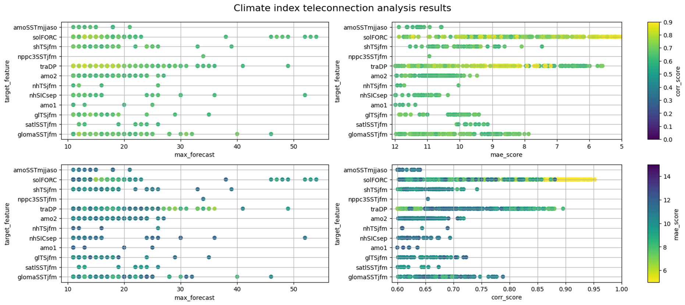

> **Key finding**: ML models can identify statistically significant teleconnections between climate indices across multi-decadal timescales, enabling 10-50 year forecasts of Atlantic Multidecadal Variability (AMV) and Pacific Decadal Variability (PDV).

## Table of Contents

1. [Overview](#overview)
2. [Data Sources](#data-sources)
3. [Methodology](#methodology)
4. [Sample Results](#sample-results)
5. [Getting Started](#getting-started)
6. [CLI Reference](#cli-reference)
7. [NAIC Orchestrator VM Deployment](#naic-orchestrator-vm-deployment)
8. [Troubleshooting](#troubleshooting)
9. [References](#references)
10. [License](#license)

## Overview

This repository demonstrates how machine learning models, combined with high-performance computing, can analyze climate teleconnections. Teleconnections are large-scale patterns of climate variability linking distant regions. Understanding them is critical for predicting long-term climate changes.

The framework uses ML to identify relationships between climate indices ("predictor variables") and forecast future climate conditions ("target variables"). Both linear and non-linear models are employed, with performance assessed via correlation coefficients and Mean Absolute Error (MAE).

The interactive [`demonstrator-v1.orchestrator.ipynb`](demonstrator-v1.orchestrator.ipynb) notebook showcases the full workflow.

### What This Repository Includes

| Component | Description |
|-----------|-------------|
| `dataset/` | Three NorESM1-F simulation datasets with 65 climate indices |
| `scripts/lrbased_teleconnection/` | ML training pipeline (data loading, models, evaluation, plotting) |
| `demonstrator-v1.orchestrator.ipynb` | Interactive Jupyter notebook for NAIC Orchestrator VMs |
| `demonstrator.ipynb` | Full analysis notebook (legacy) |
| `content/` | Sphinx tutorial documentation |
| `AGENT.md` / `AGENT.yaml` | AI coding assistant instructions |

## Data Sources

Data comes from three long-term simulations produced using the Norwegian Earth System Model (NorESM1-F):

1. **Historical SLOW Forcing (850-2005 AD)**: Low solar variability, transient volcanic activity, anthropogenic effects
2. **Historical HIGH Forcing (850-2005 AD)**: High solar variability variant
3. **Pre-Industrial Control (1000 years)**: Constant solar/volcanic forcing, pre-industrial (1850-level) anthropogenic forcing

The 65 climate indices include:

- **Surface temperatures**: `glTSann`, `nhTSann`, `shTSann`
- **Sea surface temperatures (SST)**: `amoSSTann`, `satlSSTann`, `ensoSSTjfm`
- **Sea ice concentration (SIC)**: `nhSICmar`, `nhSICsep`, `shSICmar`, `shSICsep`
- **Precipitation**: `nchinaPRjja`, `yrvPRjja`, `ismPRjja`
- **Atmospheric pressure**: `naoPSLjfm`, `eapPSLjfm`, `scpPSLjfm`
- **Ocean circulation**: `AMOCann`, `traBO`, `traBS`

See [documentations/CLIMATE-INDICES.md](documentations/CLIMATE-INDICES.md) for the full index reference.

## Methodology

1. **Data collection**: Load climate index data from NorESM1-F simulations (65 indices, 1845-2005)
2. **Preprocessing**: Normalize all indices to a uniform 0-100 scale for cross-index consistency
3. **Dataset splitting**: 60% training / 40% testing with no information leakage
4. **Feature engineering**: Generate lagged features to capture temporal dependencies; optionally compute rolling median statistics
5. **Model training**: Train ensemble of models, average feature importances, select top-N features
6. **Evaluation**: Assess with Pearson correlation and MAE; generate accuracy landscape and feature importance plots
7. **Optional wavelet filtering**: Apply Morlet wavelet bandpass filter to isolate specific frequency bands

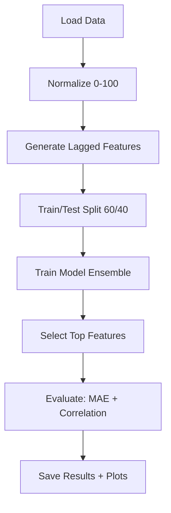

**Available models**:

| Model | Type | GPU | Use Case |
|-------|------|-----|----------|
| LinearRegression | Linear baseline | No | Quick feature screening |
| LRforcedPSO | PSO-constrained linear | No | Balanced feature weights |
| RandomForestRegressor | Ensemble | No | Non-linear with interpretability |
| MLPRegressor | Neural network | No | Complex non-linear patterns |
| XGBoost | Gradient boosting | Yes | Maximum accuracy with GPU |

## Sample Results

### Summary Overview (All Targets)

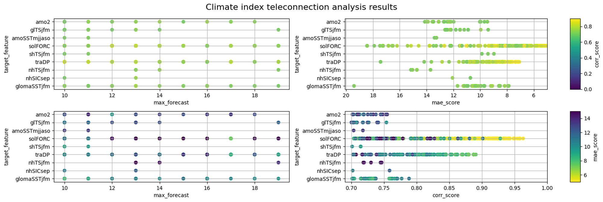

### Individual Target Forecasts

**glomaSSTjfm (10-20 year forecast)**

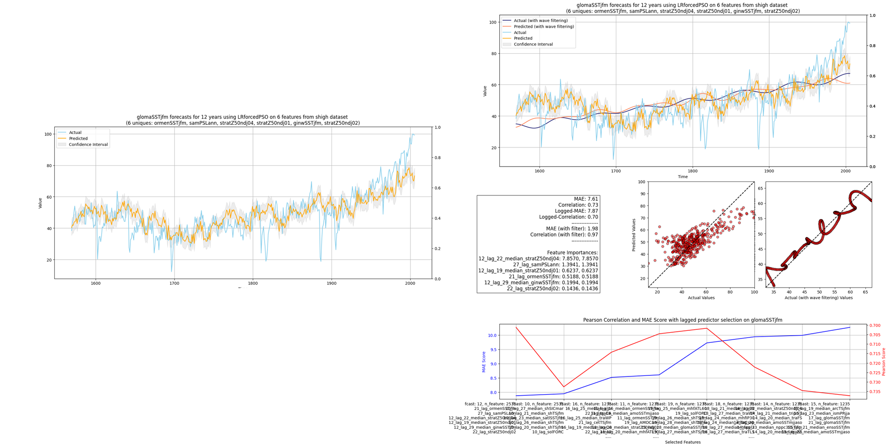

**shTSjfm (10-20 year forecast)**

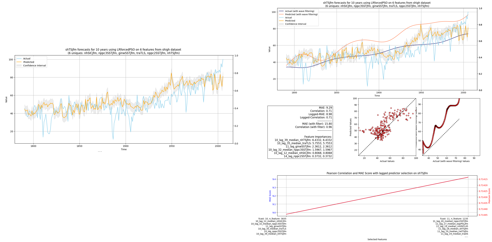

**amo2 (10-20 year forecast)**

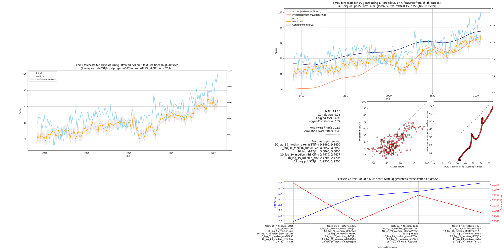

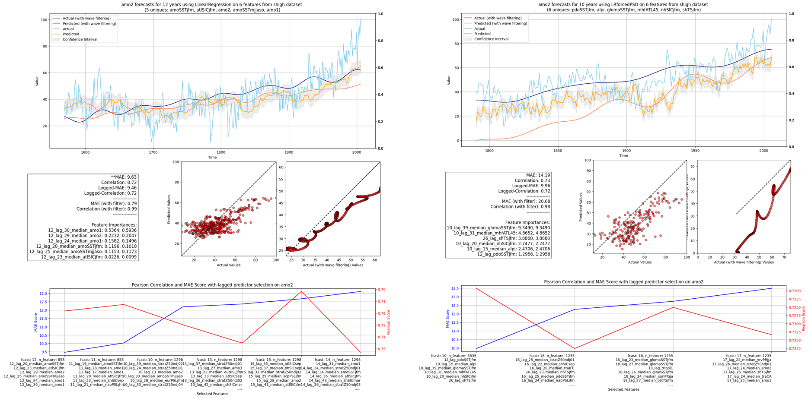

**amoSSTmjjaso (10-20 year forecast)**

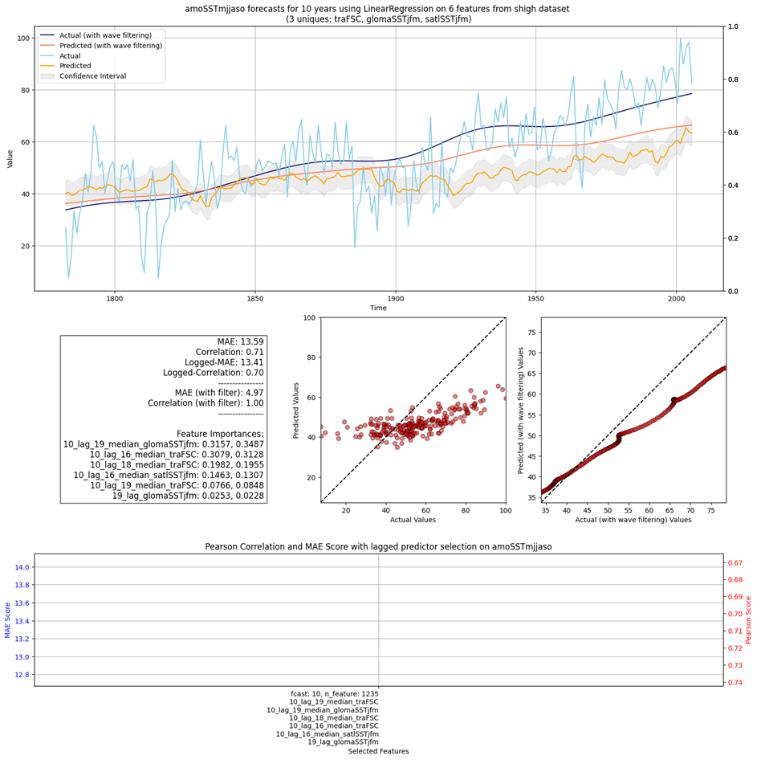

**gITSjfm (10-20 year forecast)**

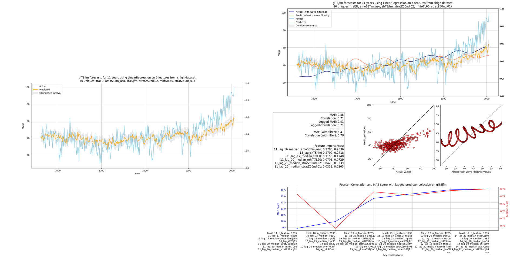

**nhSICsep (10-20 year forecast)**

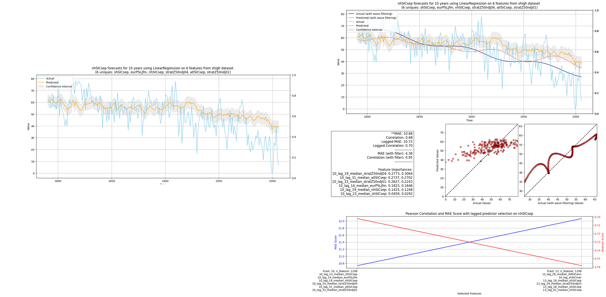

**solFRC & traDP (10-20 year forecast)**

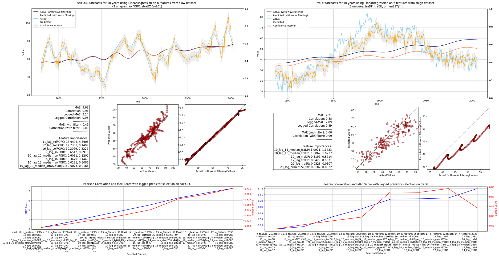

### Result File Format

| Column | Description |
|--------|-------------|
| `model` | Model name |
| `target_feature` | Predicted variable |
| `max_lag` | Maximum lag in years |
| `corr_score` | Pearson correlation coefficient |
| `mae_score` | Mean Absolute Error |
| `selected_features` | Features used by model |

## Getting Started

### Project Structure

```
wp7-UC1-climate-indices-teleconnection/
├── AGENT.md                            # AI assistant instructions
├── AGENT.yaml                          # AI assistant config (YAML)
├── Makefile                            # Sphinx docs build
├── README.md
├── content/                            # Sphinx tutorial documentation
│   ├── episodes/                       # Tutorial episodes (8 chapters)
│   └── images/                         # Tutorial images
├── dataset/                            # Climate datasets
│   ├── noresm-f-p1000_slow_new_jfm.csv
│   ├── noresm-f-p1000_shigh_new_jfm.csv
│   └── noresm-f-p1000_picntrl_new_jfm.csv
├── demonstrator-v1.orchestrator.ipynb  # Interactive notebook (Orchestrator VM)
├── demonstrator.ipynb                  # Full analysis notebook (legacy)
├── documentations/                     # Climate indices reference
├── images/                             # Result images
├── results/                            # ML experiment outputs
├── scripts/lrbased_teleconnection/     # ML training pipeline
│   ├── main.py                         # Main entry point
│   ├── models.py                       # Model definitions (LR, PSO, RF, MLP, XGB)
│   ├── dataloader.py                   # Data loading & preprocessing
│   ├── evaluation.py                   # Model evaluation & plotting
│   ├── plotting.py                     # Result visualization
│   └── libs.py                         # Shared imports & wavelet filtering
├── setup.sh                            # Python environment setup
├── vm-init.sh                          # VM initial setup
├── utils.py                            # Utility functions
└── widgets.py                          # Jupyter widget builders
```

### Installation

#### On NAIC Orchestrator VM (recommended)

```bash
git clone https://github.com/NAICNO/wp7-UC1-climate-indices-teleconnection.git
cd wp7-UC1-climate-indices-teleconnection
./setup.sh
source venv/bin/activate
```

### Usage

**Jupyter notebook** (recommended):

```bash
jupyter lab --no-browser --ip=127.0.0.1 --port=8888
# Open demonstrator-v1.orchestrator.ipynb
```

**Command line**:

```bash
python scripts/lrbased_teleconnection/main.py \
    --data_file dataset/noresm-f-p1000_slow_new_jfm.csv \
    --target_feature amo2 \
    --modelname LinearRegression \
    --max_allowed_features 6 \
    --end_lag 50
```

## CLI Reference

```
python scripts/lrbased_teleconnection/main.py [OPTIONS]
```

| Parameter | Required | Default | Description |
|-----------|----------|---------|-------------|
| `--data_file` | Yes | - | Path to CSV in `dataset/` |
| `--target_feature` | Yes | - | Variable to predict (e.g., `amo2`, `AMOCann`) |
| `--modelname` | Yes | - | Model name (see Available Models above) |
| `--max_allowed_features` | No | 6 | Maximum features to select (3-32) |
| `--end_lag` | No | 100 | Maximum lag in years (20-150) |
| `--n_ensembles` | No | 100 | Ensemble runs (1-200, forced to 1 for LinearRegression) |
| `--splitsize` | No | 0.6 | Train/test split ratio |
| `--step_lag` | No | 10 | Lag step size |
| `--main_year_start` | No | 850 | Start year filter |
| `--with_mean_feature` | No | false | Include rolling median features |
| `--with_wavelet_filter` | No | false | Apply wavelet bandpass filtering |

## NAIC Orchestrator VM Deployment

### Jupyter Access

1. Provision a VM at [https://orchestrator.naic.no](https://orchestrator.naic.no) with GPU support
2. SSH to VM and clone the repository
3. Run `./setup.sh` and `source venv/bin/activate`
4. Start Jupyter Lab:

```bash
tmux new -s jupyter
jupyter lab --no-browser --ip=127.0.0.1 --port=8888 
# Detach: Ctrl+B, then D
```

5. Create SSH tunnel from local machine:

```bash
ssh -f -N -L 8888:localhost:8888 -i <SSH_KEY_PATH> ubuntu@<VM_IP>
```

6. Open: **http://localhost:8888/lab/tree/demonstrator-v1.orchestrator.ipynb**

### Background Training

For long-running experiments, use tmux:

```bash
tmux new-session -d -s training 'cd ~/wp7-UC1-climate-indices-teleconnection && source venv/bin/activate && \
python scripts/lrbased_teleconnection/main.py \
    --data_file dataset/noresm-f-p1000_slow_new_jfm.csv \
    --target_feature amo2 \
    --modelname LRforcedPSO \
    --max_allowed_features 6 \
    --end_lag 100 \
    --n_ensembles 100 2>&1 | tee training.log'

# Monitor progress
tail -f training.log
```

### Pulling Results

```bash
rsync -avz ubuntu@<VM_IP>:~/wp7-UC1-climate-indices-teleconnection/results/ ./results/ -e "ssh -i <SSH_KEY_PATH>"
```

## Troubleshooting

| Issue | Solution |
|-------|----------|
| `git: command not found` | `sudo apt install -y git` |
| `python3: command not found` | `sudo apt install -y python3 python3-venv` |
| No GPU detected | CPU-only mode is used automatically |
| CUDA errors | Run `./vm-init.sh` to setup CUDA symlinks |
| Connection refused to VM | Verify VM is running: `ping <VM_IP>` |
| SSH permission denied | `chmod 600 <SSH_KEY_PATH>` |
| Jupyter not accessible | Check SSH tunnel: `ps aux \| grep "ssh -N -L 8888"` |
| Port 8888 in use | Use alternative: `ssh -N -L 9999:localhost:8888 ...` |

## References

- Omrani, N. E., Keenlyside, N., Matthes, K., Boljka, L., Zanchettin, D., Jungclaus, J. H., & Lubis, S. W. (2022). Coupled stratosphere-troposphere-Atlantic multidecadal oscillation and its importance for near-future climate projection. *NPJ Climate and Atmospheric Science*, 5(1), 59.

## AI Agent

See [AGENT.md](AGENT.md) for machine-readable setup instructions for AI coding assistants (Claude Code, GitHub Copilot, Cursor, etc.).

## License

- **Tutorial content** (`content/`, `*.md`, `*.ipynb`): [CC BY-NC 4.0](https://creativecommons.org/licenses/by-nc/4.0/)
- **Software code** (`*.py`, `*.sh`): [GPL-3.0-only](https://www.gnu.org/licenses/gpl-3.0.html)
- Copyright: Sigma2 / NAIC
