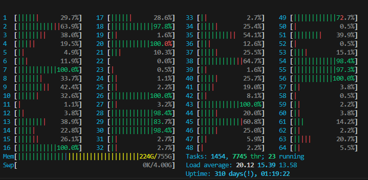

# Deployment Experience of the NAIC Teleconnection on the Sigma2 Platform

This document outlines the experience of deploying the NAIC teleconnection on the Sigma2 platform, highlighting key steps, challenges faced, and the general process. The deployment is broken down into several stages—from initial access to testing and local demonstrations—providing a clear view of both technical and operational challenges.

---

## Accessing Sigma2

Accessing Sigma2 to deploy the NAIC teleconnection begins with applying for an account. I initiated the process on **September 27, 2024**, and was granted access by **October 2, 2024**. While my approval was relatively quick, access times can vary considerably. Some users report delays due to slow processing, requiring them to create support tickets or follow up repeatedly to ensure their application is progressing.

---

## Platform Setup

Once access is granted, setting up Sigma2 for the NAIC deployment presents several hurdles, often making the initial configuration phase time-consuming and frustrating.

### Storage Allocation & Slow Access

Adequate storage is crucial when dealing with large datasets, and clarity on storage usage and limits is necessary. Installing Python environments in the **project folder** rather than the **user folder** is critical since the latter fills up quickly, causing errors when space runs out. Additionally, storage on the Sigma2 platform is occasionally slow, possibly due to the distributed nature of the data. Slow access on the Saga system was common during our deployment, resulting in significant delays during package installation and data handling.

### Jupyter & Node Access

Running Jupyter notebooks on Sigma2 is particularly challenging due to the limited interactive session time and conflicts with the SLURM queuing system. Running Jupyter notebooks on **login nodes** can consume a disproportionate amount of resources, affecting other users—a practice that is highly discouraged. Balancing the need for interactive development with resource limitations is difficult.

### Submitting SLURM Jobs

Even for users experienced with SLURM, job submission on Sigma2 can be confusing. Error messages are often vague, and debugging submission issues can take several hours. After multiple attempts, a working SLURM script was devised:

```bash
#!/bin/sh
#SBATCH --job-name=temp-jupyter
#SBATCH --nodes=1
#SBATCH --cpus-per-task=16
#SBATCH --mem=64GB  
#SBATCH --partition=normal
#SBATCH --qos=nn11063k
#SBATCH --mail-type=BEGIN
#SBATCH --time=0-08:00:00
#SBATCH --account=nn11063k

cd "$SLURM_SUBMIT_DIR"
module purge
module load Python/3.10.4-GCCcore-11.3.0
source "$SLURM_SUBMIT_DIR/env/bin/activate"
python3 -m jupyter notebook --ip=0.0.0.0 --port=9888 --no-browser --NotebookApp.token='' --NotebookApp.password=''
```

### Network Setup & Internet Connectivity

A significant challenge is the restricted internet connectivity on Sigma2. Only **login nodes** have internet access, meaning environment setup and data downloads must occur there. However, computational tasks cannot be run on login nodes and need to be transferred to **compute nodes**. This separation requires careful workflow management between nodes with different capabilities, making environment setup and job submission less convenient compared to local development systems.

### Port Forwarding for Jupyter Notebooks

Accessing Jupyter notebooks from local computers requires complex port forwarding—from the compute node to the login node, and then from the login node to the local machine. This process is prone to failure, and troubleshooting is challenging. Repeated failures in port forwarding configurations disrupt the workflow and delay interactive development.

---

## Testing & Local Demonstration

Testing the NAIC software locally before full deployment on Sigma2 is essential but fraught with challenges due to the platform's architecture.

### Excessive CPU Usage on Login Nodes

During local tests, excessive CPU usage on login nodes by other users running resource-intensive tasks was a major issue. Although the system prohibits running heavy jobs on login nodes, enforcement appears lax. This results in slow and unreliable access, hindering the ability to perform basic operations efficiently.



### Queue Resources & Node Limitations

Sigma2 operates on a queue-based allocation system, meaning jobs must wait for available compute nodes. This can lead to significant delays, especially when testing new configurations. Node restrictions sometimes limit performance and testing scope, requiring adjustments to job specifications and additional testing iterations.

---

## Launching a Live Demonstration

The final phase involved deploying the NAIC teleconnection for a live demonstration—a process complicated by Sigma2's limitations in supporting continuous live services and challenges in integrating different platforms.

### Challenges in HPC Processing and Service Platform Communication

A significant obstacle was the separation between the High-Performance Computing (HPC) resources on Sigma2 (like the Saga cluster) and the NIRD Service Platform. Communication between these platforms was not seamless, leading to fragmented workflows.

Mounting HPC project storage directly onto the NIRD Service Platform was not possible. This limitation meant data processed on one platform couldn't be directly accessed from the other, necessitating manual data transfers using secure copy protocols (SCP). This added complexity and increased the potential for errors and data inconsistencies.

Configuring shared data in JupyterHub provided a partial solution by exposing project directories within the Jupyter environment under the `/mnt` folder. However, submitting SLURM jobs still required opening a terminal within Jupyter and establishing an SSH connection to an HPC login node, adding extra steps to the workflow.

### Limitations of the Service Platform

Additional challenges stemmed from inherent limitations of the NIRD Service Platform:

- **Minimal Computing Power**: The Service Platform offered limited computational resources, insufficient for the intensive tasks required by the NAIC teleconnection demonstrator. This necessitated offloading processing tasks to HPC resources, complicating the workflow.

- **Unreliable Application Launches**: Frequent failures occurred when launching applications like JupyterHub, often without informative error messages. These failures hindered progress, as diagnosing and resolving issues without detailed feedback was challenging.

- **Difficulty in Self-Troubleshooting**: The lack of detailed error logs or guidance made it hard to identify and fix problems independently, increasing reliance on support teams and causing delays.

These issues collectively slowed down the deployment process and required significant time and effort to manage. The fragmented workflow and platform limitations diverted attention from developing and refining the teleconnection demonstrator, impacting overall efficiency.

---